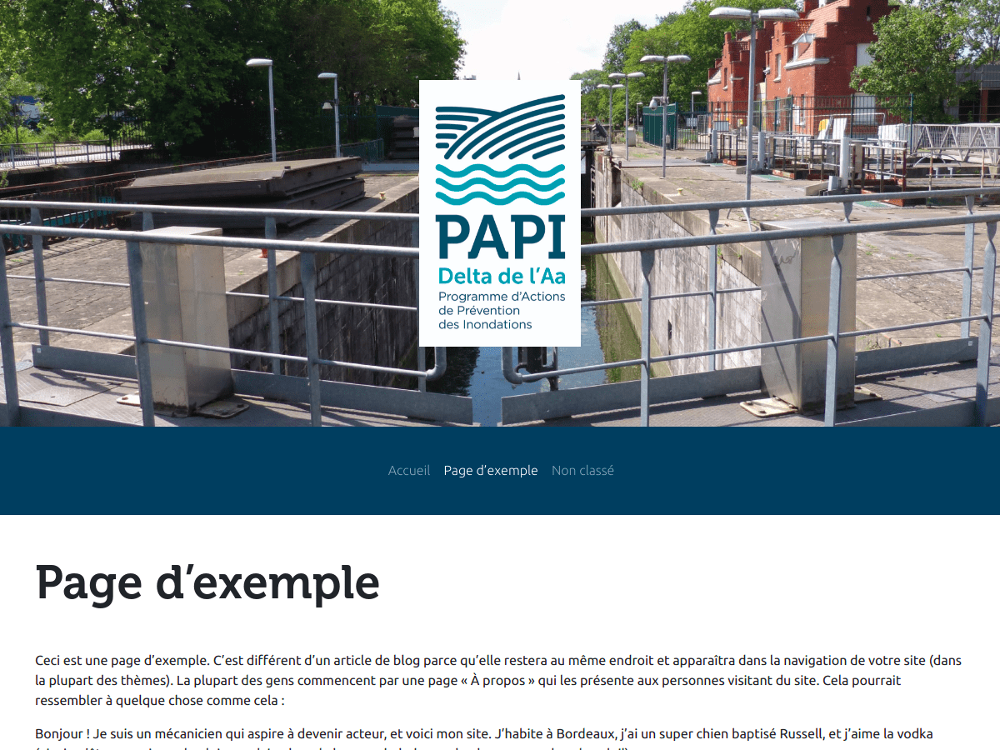

# PAPI Wordpress theme

This is a Wordpress theme made for the "Delta de l'Aa" flooding prevention plan.

### Changelog

##### v0.3

* Displaying articles thumbnails
* Repairing back-to-top button

##### v0.2

* Adding discrete scrollbars
* Adding back-to-top button
* SVG logos are used by default to save disk space
* A script allows to package theme for importation
* Menu logo does not appear when menu intersects screen bottom

##### v0.1 (initial release)

* Adding pages templates
* Several elements can be customized (logos, header image, contact text)